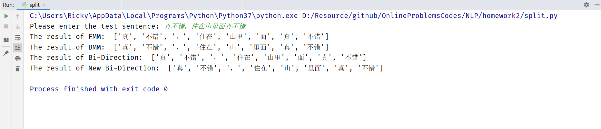
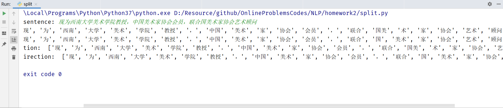

# 作业2
## 题目要求
使用前向、后向算法实现一个简单中文分词器，附件中有一个词典可供同学们使用。

要求：（1）提交电子文档一份（word），内含两部分内容：程序源码文本，程序运行结果截图；（2）同时提交源程序文件（可采用任意语言开发）。

## 源码及设计思路
### readData 数据读取
从数据文件data.txt中读取数据，并将词与词频存入字典
```python
def readData():
    with open('data.txt', 'r', encoding='utf-8') as f:
        lines = f.readlines()
        dict = {}
        for l in lines:
            info = l.split(l[1])
            word = info[1].split('\n')[0]
            dict.setdefault(word, int(info[0]))
        return dict
```
### matchForward 前向匹配
按语句顺序方向正向匹配对应词，并返回分词结果
```python
def matchForward(sentence, dict):
    max_len = 10
    length = len(sentence)
    result = []
    while length > 0:
        word = sentence[0:max_len]
        while word not in dict:
            if (len(word) == 1):
                break
            word = word[0:len(word) - 1]
        if (word != ''):
            result.append(word)
        sentence = sentence[len(word):]
        length = len(sentence)
    return result
```
### matchBack 后向匹配
按语句顺序方向反向匹配对应词，并返回分词结果
```python
def matchBack(sentence, dict):
    max_len = 10
    length = len(sentence)
    result = []
    while length > 0:
        word = sentence[length - max_len:length]
        while word not in dict:
            if (len(word) == 1):
                break
            word = word[1:length]
        if (word != ''):
            result.append(word)
        length = len(sentence)
        sentence = sentence[0:length - len(word)]
    result.reverse()
    return result
```
### matchBi 双向匹配（方法一）
通过对比正向与后向匹配分词结果的颗粒度选择适合的结果
```python
def matchBi(result1, result2):
    len1 = len(result1)
    len2 = len(result2)
    if (result1 == result2):
        return result1
    if (len1 > len2):
        return result2
    elif (len1 < len2):
        return result1
    n = 1
    while (n <= max(len1, len2)):
        cnt1 = countWord(n, result1)
        cnt2 = countWord(n, result2)
        if (cnt1 < cnt2):
            return result1
        elif (cnt1 > cnt2):
            return result2
        else:
            if (cnt1 == 0):
                return result1
            else:
                n += 1
```
### countWord 统计词频
对分词结果中不同颗粒度的词频进行统计，并返回计数结果。
输入n表示统计的词的长度。
```python
def countWord(n, result):
    cnt = 0
    for word in result:
        if n == len(word):
            cnt += 1
    return cnt
```
### matchBi2 双向匹配（方法二）
通过分词结果词频乘积计算出概率，并依此对正向与后向匹配结果进行选择
```python
def matchBi2(result1, result2, dict):
    cnt1 = 1
    cnt2 = 1
    for word in result1:
        if (word in dict):
            cnt1 *= dict[word]
        else:
            cnt1 *= 1
    for word in result2:
        if (word in dict):
            cnt2 *= dict[word]
        else:
            cnt2 *= 1
    if (cnt1 > cnt2):
        return result1
    else:
        return result2
```
### main 主方法
读取数据 -> 输入测试用例 -> 分别输出正向，后向，双向，双向2匹配分词结果
```python
if __name__ == "__main__":
    dict = readData()
    sentence = input("Please enter the test sentence: ")
    result1 = matchForward(sentence, dict)
    print("The result of FMM: ", result1)
    result2 = matchBack(sentence, dict)
    print("The result of BMM: ", result2)
    result3 = matchBi(result1, result2)
    print("The result of Bi-Direction: ", result3)
    result4 = matchBi2(result1, result2, dict)
    print("The result of New Bi-Direction: ", result4)
```
## 运行结果截图






